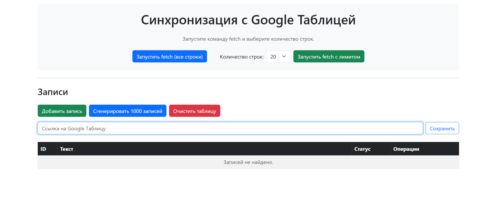

# 🧾 Сервис синхронизации с Google Таблицей на Laravel

Приложение на Laravel, которое синхронизирует записи из базы данных с публичной Google Таблицей. Поддерживает полное управление записями, автоматическую синхронизацию, настройку URL таблицы и веб-интерфейс.

---

## ✨ Возможности

- CRUD-операции для модели `Record`
- Статус записи: `Allowed` / `Prohibited`
- Автогенерация 1000 записей (поровну по статусам)
- Кнопка для удаления всех записей
- Форма для ввода URL Google Таблицы (доступной для редактирования)
- Фоновая синхронизация каждую минуту:
  - В таблицу выгружаются только записи со статусом `Allowed`
  - При изменении статуса на `Prohibited` запись удаляется из таблицы
  - При возвращении статуса `Allowed` — добавляется обратно
  - Удалённые записи также удаляются из таблицы
- Поддержка сохранённых вручную комментариев в таблице
- Веб-маршрут `/fetch` с выводом консоли (можно указать количество `/fetch/20`)
- Консольная команда с параметром `--count` и прогрессбаром
- UI стилизован с использованием Bootstrap

---

## 🛠️ Технологии

- Laravel 8+
- PHP 8.1+
- Bootstrap 5
- Blade
- Google Sheets API (через Google PHP Client)
- MySQL
- Artisan Команды
- Планировщик задач Laravel

---

## 💻 Деплой демонстрационной версии

    👉 https://sheet-sync-demo.railway.app

## ⚠️ ВАЖНО: Доступ к Google Таблице

### Для того чтобы данные успешно синхронизировались с Google Таблицей, необходимо:

1. Перейти в настройки доступа Google Таблицы (`Файл → Настроить доступ` или кнопка **«Поделиться»** в правом верхнем углу).
2. В поле **«Пользователи и группы»** добавить следующий Gmail-адрес: 
- sheet-sync-bot@airy-highlander-455120-a9.iam.gserviceaccount.com
3. Установить ему **права на редактирование** (Editor).
4. Нажать **«Отправить»**.

🔒 Без этого шага сервис не сможет читать и записывать данные в Google Таблицу.

<br>

## 📷 Скриншот приложения
<br>



<br>

## 🚀 Установка

1. **Клонируйте репозиторий**
```bash
    git clone https://github.com/arturyeszhanov/sheet-sync.git
    cd sheet-sync
```

2. **Установите зависимости**

```bash
    composer install
    npm install && npm run dev
```

3. Скопируйте `.env.example` → `.env` и сгенерируйте ключ:
```bash
    cp .env.example .env
    php artisan key:generate
```

4. Настройте .env файл
```bash
    DB_CONNECTION=mysql
    DB_HOST=127.0.0.1
    DB_PORT=3306
    DB_DATABASE=your_db
    DB_USERNAME=root
    DB_PASSWORD=

    # Настройки Google API
    GOOGLE_SERVICE_ACCOUNT_JSON=/путь/к/service-account.json
```

5. Запустите миграции
```bash
    php artisan migrate
```


5. (По желанию) Настройте cron для планировщика
```bash
    * * * * * cd /путь/к/проекту && php artisan schedule:run >> /dev/null 2>&1
```
## 🧵 Ручная синхронизация

### Через терминал:
```bash
php artisan sheets:fetch --count=20
```
### Через браузер:

- /fetch — получить все записи
- /fetch/20 — получить только 20 записей